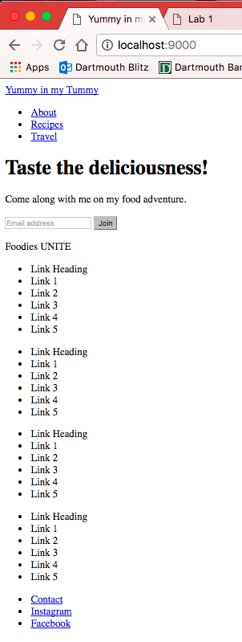

# Lab 1
## Building a Landing Page

### Layout

### Description of the page
I created a food blog landing page using flexboxes and laying out several divs for each part of the page. The page is all under one large div "main-container" and then I have another div within it called "loading-page" which is what you first see on the website. It is the section with the background image of the blueberries. This contains a navigation bar at the top and then another container, "home-container" that stores the main text and the email entry. I added some additional effects to the navigation bar so that anytime you hover over the different elements, the element background is highlighted in gray. I also adjusted the border radius so that it was more curved to go with the playful font of the page. I added a nice grayed out background to the email entry component so that it is separated from the rest of the text and catches the viewer's attention. There is also a hover effect to the Join button so that the background color darkens. The next part of the page is the div called "link-container", which holds all the links in the page. I added hover effects to the links such that the link becomes bold when the mouse is hovering over it. Lastly, I have the footer at the bottom of the page that just has the contact, instagram, and facebook links.

Hover effects

For the smaller viewport, I adjusted the content in the loading-page so that it was centered instead of on the right side. I kept it at the bottom of the page. I changed the email entry so that the button to join was below the email address rather than next to it. I also edited the background image and cropped the side so that it captured more of the image. As for the navigation bar, I got rid of the different links (about, recipes, travel, log in) and created just one link, Menu. As for the links, I made it so that it is now in column form and it only shows the Link Heading. I added a plus icon, which when you hover over, there is a rotation transition so the icon spins 360 degrees. I used the checkbox hack for the links so that it displays the sublinks under the heading when you click on the plus icon. The height of the link div then transitions from 0 to 190px.

Small Viewport

### Extra Credit
  * checkbox hack to expand links
  * CSS rotate transition and height transition
